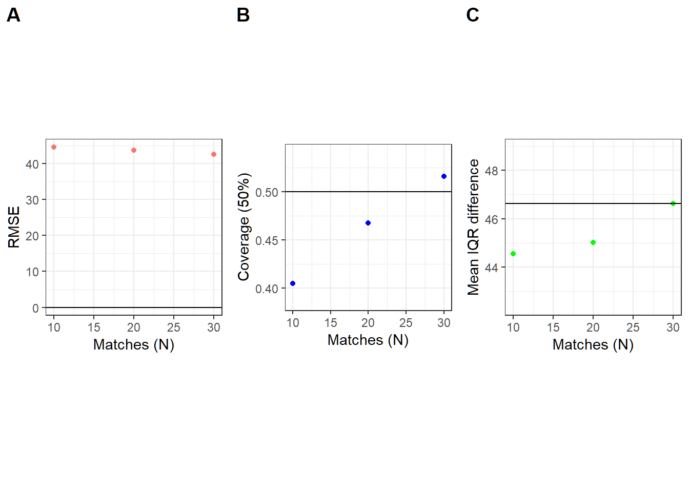
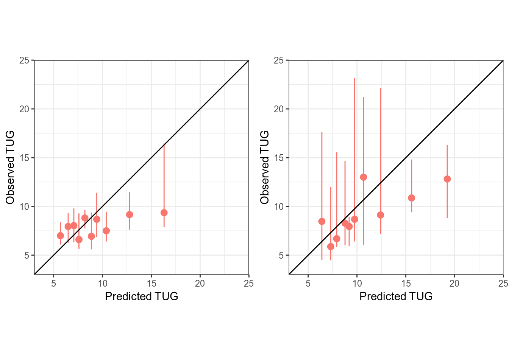

# Predictive Mean Matched Sequential K-Nearest Neighbor

<!-- badges: start -->

[](https://travis-ci.com/ck2136/PMMSKNN)
<!-- [](https://codecov.io/gh/tidyverse/dplyr?branch=master) -->
<!-- badges: end -->

## Introduction

The purpose of the this repository is to provide a method for
determining the trajectory of any longitudinal outcomes based on
obtaining predictions using a extension of a nearest neighbors algorithm
described by Dr. Alemi (a.k.a. [sequential k-nearest
neighbor](https://www.ncbi.nlm.nih.gov/pmc/articles/PMC2911789/)
(SKNN)). We extend the SKNN approach by matching similar patients using
the [predictive mean
matching](https://amstat.tandfonline.com/doi/abs/10.1080/07350015.1988.10509663).
We illustrate the use the `PMMSKNN` pacakge below briefly using the
`ChickWeight` data.

## Data

The following illustration uses the `ChickWeight` data that exists
within `base R`.

## Algorithms Employed

The main prediction method is using the `R` package
[brokenstick](https://github.com/stefvanbuuren/brokenstick), along with
[predictive mean
matching](https://books.google.com/books?hl=en&lr=&id=rM8eSRUYYHYC&oi=fnd&pg=PA442&dq=%22predictive+mean+matching%22++rubin&ots=OM-74mXZoX&sig=H-tIcTl7xqIfbgumXuHBktBTfkQ#v=onepage&q=%22predictive%20mean%20matching%22%20%20rubin&f=false)
and [gamlss](https://www.gamlss.com/). Currently the code is under
development to work within the [caret](https://github.com/topepo/caret)
and [mlr](https://github.com/mlr-org/mlr) packages.

## Installation/Compilation Tip

-   Download the github folder through

<!-- -->

    devtools::install_github('ck2136/PMMSKNN')

-   If not available then `git clone` then `R CMD Install`

<!-- -->

    git clone https://github.com/ck2136/PMMSKNN.git
    R CMD Install PMMSKNN

-   There will be dependencies that should be resolved if installation
    isn’t done through the standard R method (in R):

<!-- -->

    devtools::install_github("stefvanbuuren/brokenstick")
    devtools::install_deps('.')
    devtools::install_local('.')

## Example workflow

### Load Libraries and the `ChickWeight` data

``` r
library("pacman")
p_load(PMMSKNN, dplyr, here)
data("ChickWeight") ## example tug data
```

### Wrangle ChickWeight data

``` r
# load only the TUG dataset
full  <- ChickWeight 

# Train and Test split for all weight outcome: create 
set.seed(1234)
full <- PMMSKNN:::baselinemk(full, "Chick", "Time")

# Select 10 first patients as the test case
full %<>%
  mutate(
    # Need to convert the Chick (id column) into character
    Chick = as.numeric(as.character(Chick)),
    # Convert diet into numeric
    Diet = as.numeric(as.character(Diet)),
    # Select training and testing observations
    train_test = ifelse(Chick %in% c(1,2,10,13,14,18,20,22,25,28,30,33,37,39,40,43,47), 2, 1)
  ) %>% 
  # Need to have distinct id's for the full data
  distinct(Chick, Time, .keep_all=TRUE) 
  
# Check the structure of the dataset
full %>% str
## Classes 'nfnGroupedData', 'nfGroupedData', 'groupedData' and 'data.frame':   578 obs. of  6 variables:
##  $ weight    : num  42 51 59 64 76 93 106 125 149 171 ...
##  $ Time      : num  0 2 4 6 8 10 12 14 16 18 ...
##  $ Chick     : num  1 1 1 1 1 1 1 1 1 1 ...
##  $ Diet      : num  1 1 1 1 1 1 1 1 1 1 ...
##  $ baseline  : num  1 0 0 0 0 0 0 0 0 0 ...
##  $ train_test: num  2 2 2 2 2 2 2 2 2 2 ...
##  - attr(*, "formula")=Class 'formula'  language weight ~ Time | Chick
##   .. ..- attr(*, ".Environment")=<environment: R_EmptyEnv> 
##  - attr(*, "outer")=Class 'formula'  language ~Diet
##   .. ..- attr(*, ".Environment")=<environment: R_EmptyEnv> 
##  - attr(*, "labels")=List of 2
##   ..$ x: chr "Time"
##   ..$ y: chr "Body weight"
##  - attr(*, "units")=List of 2
##   ..$ x: chr "(days)"
##   ..$ y: chr "(gm)"
```

### preproc() creates matched test/train based on Predictive Mean Matching (PMM)

``` r
test_proc <- preproc(
                dff=full,                 # specify full dataset name
                split_var = 'train_test', # train test split variable
                trainval = 1,             # training set value
                testval = 2,              # test set value
                knots_exp = c(0, 4, 8, 16), # Specify broken stick knots
                out_time = 16,            # specify which timepoint to use 
                outcome = "weight",          # specify outcome variable name
                time_var = "Time",        # specify time variable name
                id = "Chick",    # specify id variable name
                baseline_var = "baseline", # specify baseline variable
                varlist = c("Diet") # specify list of covariates for pmm
                #filter_exp = "Time > 2"   # Filter observations that will be included
)
## Time is not an integer! converting to integer! May need to check if this makes sense!
## boundary (singular) fit: see ?isSingular
test_proc %>% str(max.level=1)
## List of 8
##  $ train_post:'data.frame':  351 obs. of  6 variables:
##  $ train_o   :'data.frame':  33 obs. of  8 variables:
##  $ reg_df    :'data.frame':  33 obs. of  6 variables:
##  $ reg_obj   :List of 12
##   ..- attr(*, "class")= chr "lm"
##  $ test_post :'data.frame':  177 obs. of  6 variables:
##  $ test_o    :'data.frame':  17 obs. of  8 variables:
##  $ bs_obj    :List of 12
##   ..- attr(*, "class")= chr "brokenstick"
##  $ varname   : chr [1:5] "weight" "Time" "Chick" "baseline" ...
```

-   Depending on the `knots_exp` specified and the `out_time` time
    chosen, there will likely be warnings about parameter estimation
    within the `brokenstick()` algorithm. Here is where the researcher
    needs to consider the appropriate values for the variable in terms
    of clinical relevance and the data at hand.

### LOOCV: `loocv_function()` calculates performance measure

``` r
res <- loocv_function(
  
  # specify number or vector of numbers from {1,...,total number of patients in training data} 
  nearest_n = c(10,20,30),
  # Specify the preprocessed object that contains the training and testing datasets
  preproc=test_proc,

  # Specify number of cores for parallel processing
  parallel=3,
  
  # Specify use of cubic spline or not
  cs=TRUE,
  
  # specify degrees of freedom use or not
  dfspec=TRUE,
  
  # specify degree of freedom for location, scale and shape (d_f_* where * = {m, s} for location and scale default for shape is 1.
  # specify power transformation of location (ptr_m)
  d_f_m=3, ptr_m=0.5,
  d_f_s=1,
  
  # Specify distribution for location, scale and shape 
  dist_fam = gamlss.dist::NO)
```

### Plots: `plot_cal()` returns a plot of the performance measures from the LOOCV

``` r
plot_cal(plotobj = res, 
         test_proc = test_proc, 
         obs_dist = "median",
         outcome = "weight",
         filt=FALSE,
         pred_sum="mean",
         #plot_by=seq(10,150,5),
         loocv=TRUE,
         filter_exp = NULL,
         plot_cal_zscore=FALSE,
         wtotplot=FALSE,
         plotvals=FALSE,
         iqrfull=NULL,
         bs=FALSE
         )
```



### Plots: `plot_cal()` also returns plot of the calibration

``` r
plot_cal(plotobj = res, 
         test_proc = test_proc, 
         obs_dist = "median",
         outcome = "weight",
         loocv=FALSE
         )
## [1] "creating training calibration plot"
## [1] "creating testing calibration plot"
## [1] "creating temp and test matching data"
## [1] "binding with decile"
## [1] "filt df made in test"
## [1] "Predicting TUG values"
```



## Authors

-   [Chong Hoon Kim](mailto:chong.kim@ucdenver.edu)
-   [Dr. Kathryn Colborn](mailto:KATHRYN.COLBORN@UCDENVER.EDU)
-   [Dr. Timothy Loar](mailto:TIMOTHY.LOAR@UCDENVER.EDU)
-   [Dr. Andrew Kittelson](mailto:andrew.kittelson@ucdenver.edu)
-   [Dr. Stef van Buuren](mailto:S.vanBuuren@uu.nl)
