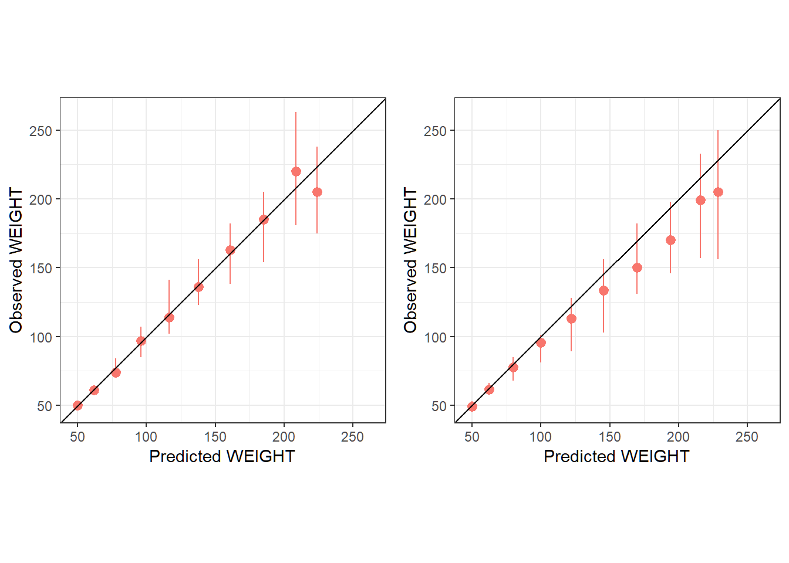

Predictive Mean Matched Sequential K-Nearest Neighbor
=====================================================

Introduction
------------

The purpose of the this repository is to provide a method for determining the trajectory of Knee Surgery Outcomes for patients based on obtaining predictions for patients using a 'patient-like-me' algorithm (a.k.a. [sequential k-nearest neighbor](https://www.ncbi.nlm.nih.gov/pubmed/20676226)).

Data
----

The data is coming from patient information recorded in the UC Health system (REDCap).

Code for Analysis
-----------------

/code folder contains the analysis code and there a scripts in the /script folder. Testing on TUG data set is done with `test_tug.R`. The main prediction method is using the R package [brokenstick](https://github.com/stefvanbuuren/brokenstick), along with [predictive mean matching](https://books.google.com/books?hl=en&lr=&id=rM8eSRUYYHYC&oi=fnd&pg=PA442&dq=%22predictive+mean+matching%22++rubin&ots=OM-74mXZoX&sig=H-tIcTl7xqIfbgumXuHBktBTfkQ#v=onepage&q=%22predictive%20mean%20matching%22%20%20rubin&f=false) and [gamlss](https://www.gamlss.com/). Currently the code is under development to work within the [caret](https://github.com/topepo/caret) and [mlr](https://github.com/mlr-org/mlr) packages.

Installation/Compilation Tip
----------------------------

-   Download the github folder through

        devtools::install_github('ck2136/PMMSKNN')

-   If not available then `git clone` then `R CMD Install`

        git clone https://github.com/ck2136/PMMSKNN.git
        R CMD Install PMMSKNN

-   There will be dependencies that should be resolved if installation isn't done through the standard R method (in R):

        ddvtools::install_github("stefvanbuuren/brokenstick")
        devtools::install_deps('.')
        devtools::install_local('.')

Example workflow
----------------

### Load Libraries and TUG data

``` r
library("pacman")
p_load(PMMSKNN, readxl, dplyr, here, magrittr)
data(tug_full) ## example tug data
```

### Wrangle TUG data

``` r
# load only the TUG dataset
full  <- tug_full

# need to exclude the above patients
# exclude also time > 200
full <- full %>%
    #filter(!patient_id %in% exclude$patient_id & time < 200)
    filter(time < 200) %>%
    mutate(gender = as.factor(gender))

# Select patient id's that have TUG < 2 or > 70 after time > 3 
exclude <- full %>% filter(tug < 2 | (tug > 70 & time > 3)) %>% dplyr::select(patient_id) %>%
    bind_rows(
              # need to exclude patients that have no post operative time beyond 2 from the train pre and possibly test pre because if people don't have post operative time in test it doesn't make sense
              full %>%
                  group_by(patient_id) %>%
                  filter(max(time) < 3) %>%
                  distinct(patient_id))

full <- full %>%
    filter(!patient_id %in% exclude$patient_id & time < 200)

# Train and Test split for all TKA outcomes: create 
set.seed(1234)
full <- PMMSKNN:::baselinemk(full, "patient_id", "time")

# Need to have distinct patient id's for the full data
full %<>%
    distinct(patient_id, time, .keep_all=TRUE)
```

### preproc() creates matched test/train based on PMM

``` r
test_proc <- preproc(
                dff=full,                 # specify full dataset name
                split_var = 'train_test', # train test split variable
                trainval = 1,             # training set value
                testval = 2,              # test set value
                knots_exp = c(0, 14, 50, 90), # Specify broken stick knots
                out_time = 90,            # specify which timepoint to use 
                outcome = "tug",          # specify outcome variable name
                time_var = "time",        # specify time variable name
                pat_id = "patient_id",    # specify patient id variable name
                varlist = c("age","gender","bmi","b_tug"), # specify list of covariates for pmm
                filter_exp = "time > 3"   # Filter observations that will be included
)
## time is not an integer! converting to integer! May need to check if this makes sense!
## Warning: number of observations (=1325) <= number of random effects
## (=1990) for term (0 + x1 + x2 + x3 + x4 + x5 | subjid); the random-effects
## parameters and the residual variance (or scale parameter) are probably
## unidentifiable
## boundary (singular) fit: see ?isSingular
test_proc %>% str(max.level=1)
## List of 5
##  $ train_post:Classes 'tbl_df', 'tbl' and 'data.frame':  1325 obs. of  9 variables:
##  $ train_o   :'data.frame':  398 obs. of  8 variables:
##  $ reg_obj   :List of 13
##   ..- attr(*, "class")= chr "lm"
##  $ test_post :Classes 'tbl_df', 'tbl' and 'data.frame':  602 obs. of  9 variables:
##  $ test_o    :Classes 'tbl_df', 'tbl' and 'data.frame':  201 obs. of  8 variables:
```

### LOOCV: loocv\_function() calculates performance measure

``` r
res <- loocv_function(
  
  # specify number or vector of numbers from {1,...,total number of patients in training data} 
  nearest_n = c(13:14),
  # enter training and testing post operative and fitted y90 dataset
  train_post = test_proc$train_post,
  ord_data = test_proc$train_o,
  test_post = test_proc$test_post,
  test_o = test_proc$test_o,
  # Specify outcome variable and time variable name
  outcome = "tug",
  time_elapsed = "time",
  interval = 10,

  # Specify number of cores for parallel processing
  parallel=3,
  
  # Specify use of cubic spline or not
  cs=TRUE,
  
  # specify degrees of freedom use or not
  dfspec=TRUE,
  
  # specify degree of freedom for location, scale and shape (d_f_* where * = {m, s} for location and scale default for shape is 1.
  # specify power transformation of location (ptr_m)
  d_f_m=3, ptr_m=0.5,
  d_f_s=1,
  
  # Specify distribution for location, scale and shape 
  #dist_fam = gamlss.dist::NO)
  dist_fam = gamlss.dist::NO)
```

### Plots: plot\_cal() returns a plot of the performance measures from the LOOCV

``` r
plot_cal(plotobj = res, test_proc = test_proc, 
         obs_dist = "median")
## Warning in mean.default(x$prec, na.rm = TRUE): argument is not numeric or
## logical: returning NA

## Warning in mean.default(x$prec, na.rm = TRUE): argument is not numeric or
## logical: returning NA

## Warning in mean.default(x$prec, na.rm = TRUE): argument is not numeric or
## logical: returning NA

## Warning in mean.default(x$prec, na.rm = TRUE): argument is not numeric or
## logical: returning NA

## Warning in mean.default(x$prec, na.rm = TRUE): argument is not numeric or
## logical: returning NA

## Warning in mean.default(x$prec, na.rm = TRUE): argument is not numeric or
## logical: returning NA

## Warning in mean.default(x$prec, na.rm = TRUE): argument is not numeric or
## logical: returning NA

## Warning in mean.default(x$prec, na.rm = TRUE): argument is not numeric or
## logical: returning NA

## Warning in mean.default(x$prec, na.rm = TRUE): argument is not numeric or
## logical: returning NA

## Warning in mean.default(x$prec, na.rm = TRUE): argument is not numeric or
## logical: returning NA

## Warning in mean.default(x$prec, na.rm = TRUE): argument is not numeric or
## logical: returning NA

## Warning in mean.default(x$prec, na.rm = TRUE): argument is not numeric or
## logical: returning NA

## Warning in mean.default(x$prec, na.rm = TRUE): argument is not numeric or
## logical: returning NA

## Warning in mean.default(x$prec, na.rm = TRUE): argument is not numeric or
## logical: returning NA

## Warning in mean.default(x$prec, na.rm = TRUE): argument is not numeric or
## logical: returning NA

## Warning in mean.default(x$prec, na.rm = TRUE): argument is not numeric or
## logical: returning NA

## Warning in mean.default(x$prec, na.rm = TRUE): argument is not numeric or
## logical: returning NA

## Warning in mean.default(x$prec, na.rm = TRUE): argument is not numeric or
## logical: returning NA

## Warning in mean.default(x$prec, na.rm = TRUE): argument is not numeric or
## logical: returning NA

## Warning in mean.default(x$prec, na.rm = TRUE): argument is not numeric or
## logical: returning NA

## Warning in mean.default(x$prec, na.rm = TRUE): argument is not numeric or
## logical: returning NA

## Warning in mean.default(x$prec, na.rm = TRUE): argument is not numeric or
## logical: returning NA

## Warning in mean.default(x$prec, na.rm = TRUE): argument is not numeric or
## logical: returning NA

## Warning in mean.default(x$prec, na.rm = TRUE): argument is not numeric or
## logical: returning NA

## Warning in mean.default(x$prec, na.rm = TRUE): argument is not numeric or
## logical: returning NA

## Warning in mean.default(x$prec, na.rm = TRUE): argument is not numeric or
## logical: returning NA

## Warning in mean.default(x$prec, na.rm = TRUE): argument is not numeric or
## logical: returning NA

## Warning in mean.default(x$prec, na.rm = TRUE): argument is not numeric or
## logical: returning NA

## Warning in mean.default(x$prec, na.rm = TRUE): argument is not numeric or
## logical: returning NA

## Warning in mean.default(x$prec, na.rm = TRUE): argument is not numeric or
## logical: returning NA

## Warning in mean.default(x$prec, na.rm = TRUE): argument is not numeric or
## logical: returning NA

## Warning in mean.default(x$prec, na.rm = TRUE): argument is not numeric or
## logical: returning NA

## Warning in mean.default(x$prec, na.rm = TRUE): argument is not numeric or
## logical: returning NA

## Warning in mean.default(x$prec, na.rm = TRUE): argument is not numeric or
## logical: returning NA

## Warning in mean.default(x$prec, na.rm = TRUE): argument is not numeric or
## logical: returning NA

## Warning in mean.default(x$prec, na.rm = TRUE): argument is not numeric or
## logical: returning NA

## Warning in mean.default(x$prec, na.rm = TRUE): argument is not numeric or
## logical: returning NA

## Warning in mean.default(x$prec, na.rm = TRUE): argument is not numeric or
## logical: returning NA

## Warning in mean.default(x$prec, na.rm = TRUE): argument is not numeric or
## logical: returning NA

## Warning in mean.default(x$prec, na.rm = TRUE): argument is not numeric or
## logical: returning NA

## Warning in mean.default(x$prec, na.rm = TRUE): argument is not numeric or
## logical: returning NA

## Warning in mean.default(x$prec, na.rm = TRUE): argument is not numeric or
## logical: returning NA

## Warning in mean.default(x$prec, na.rm = TRUE): argument is not numeric or
## logical: returning NA

## Warning in mean.default(x$prec, na.rm = TRUE): argument is not numeric or
## logical: returning NA

## Warning in mean.default(x$prec, na.rm = TRUE): argument is not numeric or
## logical: returning NA

## Warning in mean.default(x$prec, na.rm = TRUE): argument is not numeric or
## logical: returning NA

## Warning in mean.default(x$prec, na.rm = TRUE): argument is not numeric or
## logical: returning NA

## Warning in mean.default(x$prec, na.rm = TRUE): argument is not numeric or
## logical: returning NA

## Warning in mean.default(x$prec, na.rm = TRUE): argument is not numeric or
## logical: returning NA

## Warning in mean.default(x$prec, na.rm = TRUE): argument is not numeric or
## logical: returning NA

## Warning in mean.default(x$prec, na.rm = TRUE): argument is not numeric or
## logical: returning NA

## Warning in mean.default(x$prec, na.rm = TRUE): argument is not numeric or
## logical: returning NA

## Warning in mean.default(x$prec, na.rm = TRUE): argument is not numeric or
## logical: returning NA

## Warning in mean.default(x$prec, na.rm = TRUE): argument is not numeric or
## logical: returning NA

## Warning in mean.default(x$prec, na.rm = TRUE): argument is not numeric or
## logical: returning NA

## Warning in mean.default(x$prec, na.rm = TRUE): argument is not numeric or
## logical: returning NA

## Warning in mean.default(x$prec, na.rm = TRUE): argument is not numeric or
## logical: returning NA

## Warning in mean.default(x$prec, na.rm = TRUE): argument is not numeric or
## logical: returning NA

## Warning in mean.default(x$prec, na.rm = TRUE): argument is not numeric or
## logical: returning NA

## Warning in mean.default(x$prec, na.rm = TRUE): argument is not numeric or
## logical: returning NA

## Warning in mean.default(x$prec, na.rm = TRUE): argument is not numeric or
## logical: returning NA

## Warning in mean.default(x$prec, na.rm = TRUE): argument is not numeric or
## logical: returning NA

## Warning in mean.default(x$prec, na.rm = TRUE): argument is not numeric or
## logical: returning NA

## Warning in mean.default(x$prec, na.rm = TRUE): argument is not numeric or
## logical: returning NA

## Warning in mean.default(x$prec, na.rm = TRUE): argument is not numeric or
## logical: returning NA

## Warning in mean.default(x$prec, na.rm = TRUE): argument is not numeric or
## logical: returning NA

## Warning in mean.default(x$prec, na.rm = TRUE): argument is not numeric or
## logical: returning NA

## Warning in mean.default(x$prec, na.rm = TRUE): argument is not numeric or
## logical: returning NA

## Warning in mean.default(x$prec, na.rm = TRUE): argument is not numeric or
## logical: returning NA

## Warning in mean.default(x$prec, na.rm = TRUE): argument is not numeric or
## logical: returning NA

## Warning in mean.default(x$prec, na.rm = TRUE): argument is not numeric or
## logical: returning NA

## Warning in mean.default(x$prec, na.rm = TRUE): argument is not numeric or
## logical: returning NA

## Warning in mean.default(x$prec, na.rm = TRUE): argument is not numeric or
## logical: returning NA

## Warning in mean.default(x$prec, na.rm = TRUE): argument is not numeric or
## logical: returning NA

## Warning in mean.default(x$prec, na.rm = TRUE): argument is not numeric or
## logical: returning NA

## Warning in mean.default(x$prec, na.rm = TRUE): argument is not numeric or
## logical: returning NA

## Warning in mean.default(x$prec, na.rm = TRUE): argument is not numeric or
## logical: returning NA

## Warning in mean.default(x$prec, na.rm = TRUE): argument is not numeric or
## logical: returning NA

## Warning in mean.default(x$prec, na.rm = TRUE): argument is not numeric or
## logical: returning NA

## Warning in mean.default(x$prec, na.rm = TRUE): argument is not numeric or
## logical: returning NA

## Warning in mean.default(x$prec, na.rm = TRUE): argument is not numeric or
## logical: returning NA

## Warning in mean.default(x$prec, na.rm = TRUE): argument is not numeric or
## logical: returning NA

## Warning in mean.default(x$prec, na.rm = TRUE): argument is not numeric or
## logical: returning NA

## Warning in mean.default(x$prec, na.rm = TRUE): argument is not numeric or
## logical: returning NA

## Warning in mean.default(x$prec, na.rm = TRUE): argument is not numeric or
## logical: returning NA

## Warning in mean.default(x$prec, na.rm = TRUE): argument is not numeric or
## logical: returning NA

## Warning in mean.default(x$prec, na.rm = TRUE): argument is not numeric or
## logical: returning NA

## Warning in mean.default(x$prec, na.rm = TRUE): argument is not numeric or
## logical: returning NA

## Warning in mean.default(x$prec, na.rm = TRUE): argument is not numeric or
## logical: returning NA

## Warning in mean.default(x$prec, na.rm = TRUE): argument is not numeric or
## logical: returning NA

## Warning in mean.default(x$prec, na.rm = TRUE): argument is not numeric or
## logical: returning NA

## Warning in mean.default(x$prec, na.rm = TRUE): argument is not numeric or
## logical: returning NA

## Warning in mean.default(x$prec, na.rm = TRUE): argument is not numeric or
## logical: returning NA

## Warning in mean.default(x$prec, na.rm = TRUE): argument is not numeric or
## logical: returning NA

## Warning in mean.default(x$prec, na.rm = TRUE): argument is not numeric or
## logical: returning NA

## Warning in mean.default(x$prec, na.rm = TRUE): argument is not numeric or
## logical: returning NA

## Warning in mean.default(x$prec, na.rm = TRUE): argument is not numeric or
## logical: returning NA

## Warning in mean.default(x$prec, na.rm = TRUE): argument is not numeric or
## logical: returning NA

## Warning in mean.default(x$prec, na.rm = TRUE): argument is not numeric or
## logical: returning NA

## Warning in mean.default(x$prec, na.rm = TRUE): argument is not numeric or
## logical: returning NA

## Warning in mean.default(x$prec, na.rm = TRUE): argument is not numeric or
## logical: returning NA

## Warning in mean.default(x$prec, na.rm = TRUE): argument is not numeric or
## logical: returning NA

## Warning in mean.default(x$prec, na.rm = TRUE): argument is not numeric or
## logical: returning NA

## Warning in mean.default(x$prec, na.rm = TRUE): argument is not numeric or
## logical: returning NA

## Warning in mean.default(x$prec, na.rm = TRUE): argument is not numeric or
## logical: returning NA

## Warning in mean.default(x$prec, na.rm = TRUE): argument is not numeric or
## logical: returning NA

## Warning in mean.default(x$prec, na.rm = TRUE): argument is not numeric or
## logical: returning NA

## Warning in mean.default(x$prec, na.rm = TRUE): argument is not numeric or
## logical: returning NA

## Warning in mean.default(x$prec, na.rm = TRUE): argument is not numeric or
## logical: returning NA

## Warning in mean.default(x$prec, na.rm = TRUE): argument is not numeric or
## logical: returning NA

## Warning in mean.default(x$prec, na.rm = TRUE): argument is not numeric or
## logical: returning NA

## Warning in mean.default(x$prec, na.rm = TRUE): argument is not numeric or
## logical: returning NA

## Warning in mean.default(x$prec, na.rm = TRUE): argument is not numeric or
## logical: returning NA

## Warning in mean.default(x$prec, na.rm = TRUE): argument is not numeric or
## logical: returning NA

## Warning in mean.default(x$prec, na.rm = TRUE): argument is not numeric or
## logical: returning NA

## Warning in mean.default(x$prec, na.rm = TRUE): argument is not numeric or
## logical: returning NA

## Warning in mean.default(x$prec, na.rm = TRUE): argument is not numeric or
## logical: returning NA

## Warning in mean.default(x$prec, na.rm = TRUE): argument is not numeric or
## logical: returning NA

## Warning in mean.default(x$prec, na.rm = TRUE): argument is not numeric or
## logical: returning NA

## Warning in mean.default(x$prec, na.rm = TRUE): argument is not numeric or
## logical: returning NA

## Warning in mean.default(x$prec, na.rm = TRUE): argument is not numeric or
## logical: returning NA

## Warning in mean.default(x$prec, na.rm = TRUE): argument is not numeric or
## logical: returning NA
```


### Plots: plot\_cal() also returns plot of the calibration

``` r
plot_cal(plotobj = res, test_proc = test_proc,
         obs_dist = "median", loocv = FALSE)  
## [1] "creating training calibration plot"
## Warning: 'tidy.numeric' is deprecated.
## See help("Deprecated")

## Warning: 'tidy.numeric' is deprecated.
## See help("Deprecated")

## Warning: 'tidy.numeric' is deprecated.
## See help("Deprecated")

## Warning: 'tidy.numeric' is deprecated.
## See help("Deprecated")

## Warning: 'tidy.numeric' is deprecated.
## See help("Deprecated")

## Warning: 'tidy.numeric' is deprecated.
## See help("Deprecated")

## Warning: 'tidy.numeric' is deprecated.
## See help("Deprecated")

## Warning: 'tidy.numeric' is deprecated.
## See help("Deprecated")

## Warning: 'tidy.numeric' is deprecated.
## See help("Deprecated")

## Warning: 'tidy.numeric' is deprecated.
## See help("Deprecated")
## Warning: Unknown or uninitialised column: 'zsc'.
## Warning in min(plotdf$zsc, na.rm = TRUE): no non-missing arguments to min;
## returning Inf
## Warning: Unknown or uninitialised column: 'zsc'.
## Warning in max(plotdf$zsc, na.rm = TRUE): no non-missing arguments to max;
## returning -Inf
## [1] "creating testing calibration plot"
## [1] "creating temp and test matching data"
## [1] "binding with decile"
## [1] "filt df made in test"
## [1] "Predicting TUG values"
## Warning: 'tidy.numeric' is deprecated.
## See help("Deprecated")
## Warning: 'tidy.numeric' is deprecated.
## See help("Deprecated")

## Warning: 'tidy.numeric' is deprecated.
## See help("Deprecated")

## Warning: 'tidy.numeric' is deprecated.
## See help("Deprecated")

## Warning: 'tidy.numeric' is deprecated.
## See help("Deprecated")

## Warning: 'tidy.numeric' is deprecated.
## See help("Deprecated")

## Warning: 'tidy.numeric' is deprecated.
## See help("Deprecated")

## Warning: 'tidy.numeric' is deprecated.
## See help("Deprecated")

## Warning: 'tidy.numeric' is deprecated.
## See help("Deprecated")

## Warning: 'tidy.numeric' is deprecated.
## See help("Deprecated")
## Warning: Unknown or uninitialised column: 'zsc'.
## Warning in min(plotdf$zsc, na.rm = TRUE): no non-missing arguments to min;
## returning Inf
## Warning: Unknown or uninitialised column: 'zsc'.
## Warning in max(plotdf$zsc, na.rm = TRUE): no non-missing arguments to max;
## returning -Inf
## Warning in extvalid(plotobj, test_proc): NA values in coverage
```



``` r
      ## Note: specify loocv = FALSE 
```

Authors
-------

-   [Chong Hoon Kim](mailto:chong.kim@ucdenver.edu)
-   [Dr. Kathryn Colborn](mailto:KATHRYN.COLBORN@UCDENVER.EDU)
-   [Dr. Timothy Loar](mailto:TIMOTHY.LOAR@UCDENVER.EDU)
-   [Dr. Andrew Kittelson](mailto:andrew.kittelson@ucdenver.edu)
-   [Dr. Stef van Buuren](mailto:S.vanBuuren@uu.nl)
